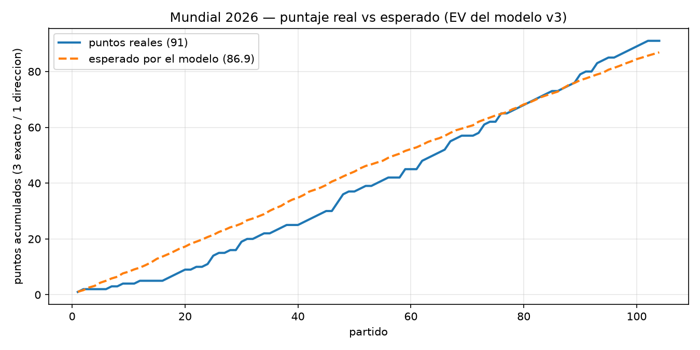

# ⚽ Prode Mundial 2026 — modelo predictivo + centro de comando

[](https://github.com/rhinoah/world-cup-predictor/actions/workflows/tests.yml)

Modelo estadístico que predice marcadores de fútbol de selecciones, y una app de
escritorio que lo acompaña durante el torneo: pronósticos sugeridos con su "por qué",
recordatorios, carga de resultados, llaves de eliminación y puntaje en vivo de dos
prodes con reglas distintas.

Construido íntegramente en sesiones de **vibe coding** con Claude Code, para jugar
dos pools de predicciones del Mundial 2026 con amigos. **No es una herramienta de
apuestas** — es un proyecto por diversión y aprendizaje.

> **El resultado que importa:** el modelo prometía ~**0.90 puntos/partido** en
> backtest histórico (9 torneos 2016–2024) y rindió **0.88** en el Mundial 2026
> real — 104 partidos completamente *out-of-sample*. No estaba sobreajustado.

---

## 🖥️ La app

*Centro de comando de escritorio (CustomTkinter, tema oscuro):*

<!-- TODO: capturas en docs/ — grilla principal, llaves, popup de carga -->

- **Próximo partido** con cuenta regresiva, banderas y tu pronóstico cargado.
- **Partidos de hoy / mañana** con el marcador sugerido por el modelo y su
  explicación: probabilidades 1X2, goles esperados, Elo y marcadores más probables.
- **Carga de resultados** con steppers, penales en eliminación, botón "terminó el
  partido" y avisos ⚠ cuando un cruce quedó empatado sin tanda cargada.
- **Llaves de eliminación** con la asignación **oficial FIFA de mejores terceros**
  (las 495 combinaciones del Annex C, parseadas de Wikipedia), ganadores que
  avanzan solos, marcadores con penales y semáforo de acierto por partido.
- **Dos prodes en paralelo** con reglas distintas (3/1/0 y 6/3/0), cada uno
  contando solo lo que cargaste en él — nombres y puntajes configurables vía
  `prodes.json` (no versionado).
- Ícono en bandeja, recordatorios sonoros, instancia única, autostart opcional y
  actualización diaria del dataset por tarea programada.

## 🧠 El modelo

La evolución (cada versión validada por backtest antes de reemplazar a la anterior):

| Versión | Idea | Backtest (pts/partido) |
|---|---|---|
| baseline | "1-0 al favorito" | 0.825 |
| v1 | Poisson con fuerzas ataque/defensa crudas + decay temporal + Dixon-Coles | — |
| v2 | fuerzas ajustadas por rival (punto fijo estilo Maher) + localía | 0.827 |
| **v3** | **v2 blendeado con Elo dinámico (w=0.6)** | **~0.90** |

Piezas clave:

- **Poisson bivariado con corrección Dixon-Coles** (ρ=−0.10) para la matriz de
  probabilidad de cada marcador.
- **Elo dinámico** propio: discrimina al favorito mejor que las fuerzas solas —
  es el componente que despega del baseline.
- **Regla de decisión por EV**: no se carga el marcador *más probable*, sino el
  que **maximiza el puntaje esperado del prode**: `EV = 2·P(exacto) + P(dirección)`.
  Solo hay 3 candidatos (el modal de cada dirección 1X2).
- **Cero data leakage**: toda feature de un partido se calcula únicamente con
  datos **anteriores** a su fecha (`date < as_of`), tanto en backtest como en vivo.
- Amistosos pesan la mitad; decay temporal; cancha neutral contemplada (en el
  Mundial solo los anfitriones juegan de local).

## 📊 Validación

**Backtest** (`backtest.py`, `backtest_elo.py`): 9 torneos grandes (Mundial, Euro,
Copa América 2016–2024), split temporal estricto, puntuando con 3/1/0.

**En vivo — Mundial 2026 (104 partidos):**

| Métrica | Valor |
|---|---|
| Puntos (3 exacto / 1 dirección) | **91** → **0.88/partido** |
| Marcadores exactos | 11 (11%) |
| Dirección acertada | 58 (56%) |
| Fallados | 35 (34%) |
| Backtest esperado | ~0.90/partido ✔ |

### Real vs esperado (EV)

`backfill_ev.py` re-ajusta el modelo *as-of* cada fecha del torneo (sin leakage)
y compara los puntos obtenidos contra el EV que el propio modelo le asignaba a
cada pronóstico cargado:



| | Real | Esperado (EV) |
|---|---|---|
| **Total (104 partidos)** | **91** | 86.9 |
| Fase de grupos (72) | 58 | 62.0 |
| Eliminación (32) | **33** | 24.9 |

Lectura honesta: el resultado quedó **dentro del rango que el propio modelo
esperaba** (+4 puntos sobre su esperanza — varianza normal): algo por debajo en
grupos (los favoritos gigantes que empataron 0-0), bastante por encima en la
eliminación. El marcador sugerido óptimo se siguió en 100 de 104 partidos.

### 🆚 Bonus: contra el mercado de predicciones

Durante las rondas finales comparamos el modelo contra **Kalshi** (mercado de
predicciones con dinero real): en la semifinal discreparon de lleno (el mercado
favorecía a Inglaterra; el modelo, a Argentina — **ganó Argentina**), y en la
final ambos favorecían a España pero el mercado con más convicción (**ganó
España**). Saldo honesto: **1 a 1** — un modelo casero le peleó de igual a igual
a un mercado real durante un Mundial.

## 🧪 Tests

**577 tests** (pytest) sobre el modelo y la capa de datos, corriendo en CI para
Python 3.11 y 3.13:

```bash
pip install -r requirements-dev.txt
pytest
```

Cubren la regla de puntaje y la decisión por EV, el scoreboard por prode, los
estados de un partido (incluida la ventana extendida de eliminación y el
override manual), el desempate FIFA de los grupos (con enfrentamiento directo),
las invariantes del bracket y la tabla oficial de terceros, el Elo (invariante
de suma cero y ausencia de leakage) y los dtypes de los CSV.

Se validaron con **mutation testing**: al introducir a propósito tres bugs
(anular los puntos por dirección, acortar la ventana de eliminación y romper el
desempate head-to-head) la suite los detectó en los tres casos.

## 🚀 Cómo correrlo

```bash
pip install -r requirements.txt

python build_features.py          # baja el dataset (martj42) y arma features
python build_pronosticos.py       # corre el modelo sobre los partidos pendientes
python prode_app.py               # la app de escritorio (Windows)

# predicción puntual de un partido:
python predict_match_v3.py "Spain" "Argentina" --neutral

# validación y análisis:
python backtest.py                # backtest del modelo de goles
python backtest_elo.py            # backtest del blend con Elo
python liquidar.py                # liquida pronósticos vs resultados reales
python backfill_ev.py             # análisis real vs esperado (EV)
pytest                            # suite de tests
```

La GUI usa `winsound`/`pystray` y está pensada para **Windows**; el modelo y los
scripts de análisis corren en cualquier plataforma.

## 🗂️ Estructura

| Archivo | Qué hace |
|---|---|
| `build_features.py` | descarga el dataset y construye la tabla de features |
| `elo.py` | rating Elo dinámico + blend de lambdas |
| `predict_match_v2.py` / `_v3.py` | modelo de fuerzas / blend con Elo (**producción**) |
| `backtest.py` / `backtest_elo.py` | validación temporal sobre torneos 2016–2024 |
| `build_pronosticos.py` | corre el v3 sobre los partidos pendientes (grupos + llaves) |
| `liquidar.py` | cruza pronósticos con resultados y calcula el puntaje |
| `backfill_ev.py` | recalcula el EV as-of de cada pronóstico (real vs esperado) |
| `app_data.py` | capa de datos de la app (fixture, scoreboard, overrides, penales) |
| `prode_app.py` | la app de escritorio (CustomTkinter) |
| `scoring.py` | reglas de puntaje del prode y la decisión por EV (fuente única) |
| `groups.py` / `bracket.py` | tablas de grupos (desempate FIFA) y llaves M73–M104 |
| `tests/` | suite pytest (577 tests) |
| `parse_thirds.py` / `thirds_table.json` | tabla oficial de asignación de terceros (495 combos) |
| `build_horarios.py` / `build_flags.py` / `make_icon.py` | fixture en hora ARG, banderas, ícono |

## 📚 Datos y créditos

- Resultados históricos de selecciones: [martj42/international_results](https://github.com/martj42/international_results) (~50k partidos).
- Banderas: [flagcdn](https://flagcdn.com/) (generadas por `build_flags.py`, no versionadas).
- Tabla de terceros: plantilla de Wikipedia del Annex C de FIFA, parseada por `parse_thirds.py`.

Los CSV de datos y los pronósticos personales **no se versionan** (ver
`.gitignore`); todo lo pesado se regenera con `build_features.py`.

## 🧭 Roadmap

- De la auditoría interna post-torneo ya salieron la regla de puntaje unificada
  (`scoring.py`) y la suite de tests. Queda partir `prode_app.py` en módulos más
  chicos y armar un padrón único de selecciones (hoy viven en estructuras paralelas).
- **Visión v2**: generalizar a un framework multi-deporte/multi-competencia —
  fuentes de datos intercambiables (con modo manual-first), formatos de torneo
  configurables (partido único / llaves / liga) y predictor pluggable por deporte.

## ⚖️ Licencia

[MIT](LICENSE). Proyecto recreativo y educativo: no constituye consejo de
apuestas ni está afiliado a FIFA.
